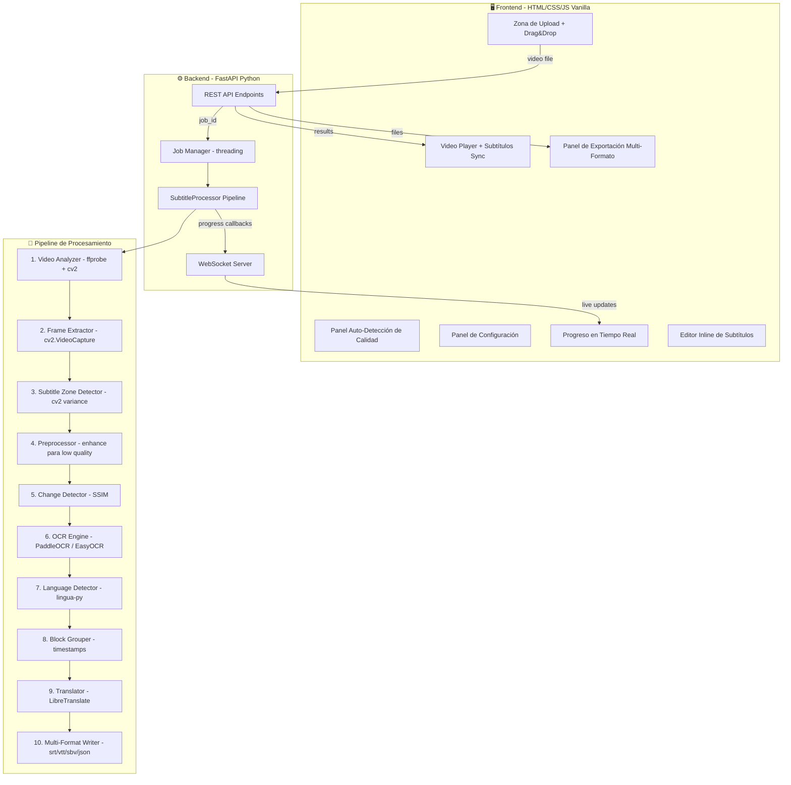

# 🎬 SubtitleForge — Plan de Implementación Detallado

## Contexto y Objetivo

La guía `guia_subtitulos_ocr.md` documenta un pipeline CLI de extracción de subtítulos quemados (hardcoded/burned-in) usando OCR. El objetivo es transformar este pipeline en una **aplicación web interactiva** de uso personal donde el usuario pueda:

1. Adjuntar un video de **cualquier tamaño** mediante drag & drop
2. El sistema **auto-detecta la calidad** (resolución, bitrate, fps, codec) y sugiere configuración óptima
3. Configurar parámetros visualmente (zona de subtítulos, sensibilidad, idioma)
4. Ver **progreso en tiempo real** via WebSocket
5. Previsualizar resultados con video sincronizado con subtítulos
6. Exportar en múltiples formatos (.srt, .vtt, .json, .sbv)
7. Traducir opcionalmente usando **LibreTranslate** (gratuito, self-hosted)

---

## Decisiones Técnicas Clave

### GPU AMD — Estrategia de Aceleración

PaddleOCR soporta AMD vía ROCm 7.0, pero principalmente para GPUs **Instinct MI-series** (datacenter). Para GPUs **Radeon consumer** (7000/9000 series), el soporte existe pero es experimental. Nuestra estrategia:

1. **Intentar ROCm**: Al iniciar, detectar si hay ROCm disponible con `paddle.is_compiled_with_rocm()`
2. **Fallback a CPU optimizado**: Si ROCm no funciona, usar CPU con `multiprocessing` para paralelizar
3. **EasyOCR como alternativa**: EasyOCR usa PyTorch, que tiene mejor soporte ROCm para Radeon consumer. Si PaddleOCR falla en GPU, ofrecer EasyOCR como motor alternativo con aceleración PyTorch+ROCm
4. **Reportar al usuario**: El panel mostrará qué backend se está usando (GPU ROCm / CPU / EasyOCR)

### Sin Límite de Tamaño de Video

- No imponemos límite artificial de tamaño
- El upload usa **chunked streaming** para manejar archivos grandes sin cargar todo en RAM
- FFprobe analiza metadatos sin decodificar el video completo
- Los frames se procesan en streaming, no se almacenan todos simultáneamente
- Se muestra espacio en disco disponible como referencia

### Traducción Gratuita con LibreTranslate

- LibreTranslate se ejecuta localmente como servicio companion (`localhost:5000`)
- Se incluye script de instalación automática
- API REST simple: `POST /translate` con `{q, source, target}`
- Traducción por lotes (batches de 10 subtítulos) para mantener contexto
- Si LibreTranslate no está disponible, la opción de traducción se desactiva con mensaje informativo

---

## Arquitectura del Sistema



---

## Estructura de Archivos del Proyecto

```
subtitle_forge/
├── server.py                      # FastAPI app + WebSocket + static files
├── processor.py                   # Orquestador del pipeline completo
├── config.py                      # Configuración global y defaults
├── job_manager.py                 # Gestión de jobs en background threads
├── modules/
│   ├── __init__.py
│   ├── video_analyzer.py          # [NUEVO] Auto-detección de calidad con ffprobe
│   ├── frame_extractor.py         # Extracción de frames con cv2
│   ├── subtitle_detector.py       # Detección de zona top/bottom/auto/custom
│   ├── preprocessor.py            # [NUEVO] Mejora de imagen para baja calidad
│   ├── change_detector.py         # Detección de cambios SSIM
│   ├── ocr_engine.py              # PaddleOCR con fallback EasyOCR
│   ├── language_detector.py       # Detección de idioma con lingua-py
│   ├── srt_writer.py              # Generación multi-formato SRT/VTT/SBV/JSON
│   └── translator.py             # LibreTranslate integration
├── frontend/
│   ├── index.html                 # SPA principal
│   ├── styles.css                 # Dark theme cinematográfico + glassmorphism
│   └── app.js                     # Lógica UI + WebSocket + state machine
├── uploads/                       # Videos subidos (temporal)
├── output/                        # Resultados por job_id
├── requirements.txt               # Dependencias Python
└── setup.sh                       # Script de instalación (ffmpeg, libretranslate, etc.)
```

---

## Detalle de Cada Módulo

### 1. `modules/video_analyzer.py` — Auto-Detección de Calidad [NUEVO]

**¿Por qué?** La guía original no analiza el video antes de procesarlo. Esto es crítico porque un video de 240p necesita configuración muy diferente a uno de 4K. El usuario dijo "que detecte la calidad" — este módulo es la respuesta.

**Qué hace:**
- Usa `ffprobe` (subprocess) para extraer: resolución, bitrate, codec, duración, fps nativo, audio tracks
- Usa `cv2.VideoCapture` para verificar resolución real y fps
- Calcula un **quality score** (0-100) basado en: resolución × bitrate × fps
- Clasifica el video en categorías: `ultra_low` (≤360p), `low` (≤480p), `medium` (≤720p), `high` (≤1080p), `ultra` (≤4K), `extreme` (>4K)
- Genera **preset de configuración recomendado** automáticamente:
  - `ultra_low`: FPS extraction=1, enhanced preprocessing ON, OCR confidence threshold=0.5
  - `low`: FPS=2, preprocessing ON, threshold=0.6
  - `medium`: FPS=2, preprocessing OFF, threshold=0.7
  - `high`: FPS=3, preprocessing OFF, threshold=0.75
  - `ultra`/`extreme`: FPS=2 (menos frames porque cada uno es pesado), threshold=0.8

**Retorna:** `VideoInfo` dataclass con todos los metadatos + preset sugerido

### 2. `modules/frame_extractor.py` — Extracción de Frames

**¿Por qué OpenCV y no solo FFmpeg?** OpenCV permite control frame-by-frame, skip preciso, y acceso directo a numpy arrays sin escribir a disco. FFmpeg se usa solo vía ffprobe para metadatos del container.

**Qué hace:**
- Abre video con `cv2.VideoCapture`
- Calcula intervalo de frames según FPS deseado vs FPS nativo del video
- Extrae frames como numpy arrays en memoria (no escribe a disco innecesariamente)
- Para videos >1080p, hace downscale a 1080p antes de OCR (el OCR no mejora con más resolución, solo es más lento)
- Genera un thumbnail del primer frame para preview en el frontend
- Reporta progreso via callback: `on_progress(stage, percent, message)`
- Usa generador (yield) para no cargar todos los frames en RAM simultáneamente

### 3. `modules/subtitle_detector.py` — Detección de Zona

Se mantiene la lógica de la guía original (análisis de varianza entre frames) con mejoras:

- **Modo auto mejorado**: Analiza hasta 60 frames (no 30) con muestreo uniforme del video
- **Zona custom**: El usuario puede definir coordenadas desde el frontend (click en el video)
- **Retorna imagen de preview** con la zona detectada resaltada (rectángulo verde) para confirmar visualmente en el frontend
- **Multi-zona**: Detecta si hay subtítulos en AMBAS zonas (top Y bottom, como en videos con dual subs)

### 4. `modules/preprocessor.py` — Mejora de Imagen para Baja Calidad [NUEVO]

**¿Por qué?** La guía original NO tiene preprocesamiento. En videos de baja calidad (≤480p, compresión fuerte), el OCR falla frecuentemente porque los subtítulos están pixelados o borrosos.

**Pipeline de preprocesamiento (aplicado solo al crop de subtítulos):**
1. **Upscale 2x** con interpolación bicúbica — agranda el texto para mejor reconocimiento
2. **Denoising** con `cv2.fastNlMeansDenoising` — elimina ruido de compresión
3. **Sharpening** con kernel de convolución — mejora bordes del texto
4. **Contrast enhancement** con CLAHE (Contrast Limited Adaptive Histogram Equalization) — mejora contraste texto vs fondo
5. **Binarización adaptativa** (opcional) con `cv2.adaptiveThreshold` — para subtítulos blancos sobre fondos variables

Cada paso es configurable (on/off) desde el panel. Se activa automáticamente cuando `quality_category` es `ultra_low` o `low`.

### 5. `modules/change_detector.py` — Detección de Cambios

Se mantiene la implementación SSIM de la guía con mejoras:

- **Filtro de frames vacíos**: Detecta frames sin subtítulo (zona uniforme) con umbral de varianza de píxeles
- **Histéresis**: Requiere que el cambio persista por al menos 2 frames consecutivos para evitar falsos positivos por flicker
- **Métricas adicionales**: Además de SSIM, opcionalmente calcula pixel diff (más rápido) como pre-filtro

### 6. `modules/ocr_engine.py` — Motor OCR con Fallback

**Estrategia de motores:**

```
¿ROCm disponible?
  ├─ SÍ → PaddleOCR con GPU ROCm
  ├─ NO → ¿PyTorch+ROCm disponible?
  │        ├─ SÍ → EasyOCR con GPU ROCm (PyTorch)
  │        └─ NO → PaddleOCR CPU (multi-thread)
```

**Funcionalidades:**
- Interfaz unificada `OCREngine` que abstrae PaddleOCR y EasyOCR
- Post-procesamiento de texto: strip, normalización de espacios, corrección de caracteres comunes (0→O, l→I según contexto)
- Scoring de confianza por línea con threshold configurable
- Caché de modelo (no reinicializar OCR por cada frame)
- Batch processing: procesa múltiples crops en un solo call cuando el motor lo soporta

### 7. `modules/language_detector.py` — Detección de Idioma

Se mantiene exactamente la implementación de la guía con lingua-py. Soporta 10 idiomas. Retorna código de idioma para el motor OCR y para LibreTranslate.

### 8. `modules/srt_writer.py` — Writer Multi-Formato

Genera 4 formatos de salida:

| Formato | Uso Principal | Diferencias Clave |
|---------|---------------|-------------------|
| `.srt` | Universal, todos los reproductores | Numeración obligatoria, separador coma en ms |
| `.vtt` | Web (HTML5 `<track>`), el video player del frontend | Header `WEBVTT`, separador punto, soporta estilos |
| `.sbv` | YouTube upload | Similar a SRT, sin numeración |
| `.json` | Datos estructurados, API consumption | Incluye metadatos completos, confianza OCR por línea |

### 9. `modules/translator.py` — Traducción con LibreTranslate

- Conecta a LibreTranslate local (`http://localhost:5000/translate`)
- Traduce en batches de 10 subtítulos para eficiencia
- Detecta si LibreTranslate está disponible al inicio; si no, desactiva la opción
- Retry logic con backoff exponencial
- Preserva timestamps originales, solo traduce el texto

### 10. `processor.py` — Orquestador del Pipeline

Clase `SubtitleProcessor` que orquesta los 9 módulos en secuencia:

```
Stage 1: Análisis de video (2%)
Stage 2: Extracción de frames (20%)  
Stage 3: Detección de zona (5%)
Stage 4: Preprocesamiento (10%) — solo si baja calidad
Stage 5: Detección de cambios (10%)
Stage 6: OCR (40%) — el más pesado
Stage 7: Detección de idioma (2%)
Stage 8: Agrupamiento + generación archivos (3%)
Stage 9: Traducción (8%) — solo si activada
```

- Ejecuta en background thread (no bloquea el servidor)
- Cada stage reporta progreso via callback → WebSocket → frontend
- Si un stage falla, reporta error específico y continúa si es posible
- Los resultados se guardan en `output/{job_id}/`

### 11. `server.py` — FastAPI Backend

**Endpoints REST:**

| Método | Ruta | Descripción |
|--------|------|-------------|
| `POST` | `/api/upload` | Sube video (chunked multipart). Retorna `{job_id, video_info}` |
| `POST` | `/api/process/{job_id}` | Inicia procesamiento con config del usuario |
| `GET` | `/api/status/{job_id}` | Estado actual del job (polling fallback) |
| `GET` | `/api/results/{job_id}` | Subtítulos extraídos en JSON |
| `GET` | `/api/download/{job_id}/{format}` | Descarga archivo .srt/.vtt/.sbv/.json |
| `GET` | `/api/thumbnail/{job_id}` | Thumbnail del video |
| `GET` | `/api/video/{job_id}` | Stream del video original |
| `GET` | `/api/zone-preview/{job_id}` | Preview de la zona detectada |
| `DELETE` | `/api/job/{job_id}` | Limpia archivos temporales |

**WebSocket:** `ws://localhost:8000/ws/{job_id}`
- Envía JSON con `{stage, stage_name, percent, message, eta_seconds}`
- Envía resultado final al completar
- Maneja desconexiones gracefully

**Archivos estáticos:** Sirve `frontend/` en la raíz `/`

### 12. `job_manager.py` — Gestión de Jobs

- Almacena estado de jobs en diccionario en memoria (uso personal, no necesita DB)
- Limpieza automática de jobs antiguos (>24h)
- Un solo job activo a la vez (uso personal)

---

## Frontend — Diseño del Panel Interactivo

### Flujo del Usuario (State Machine)

```
IDLE → UPLOADING → ANALYZING → CONFIGURING → PROCESSING → RESULTS
                                    ↑                         │
                                    └─────── RECONFIGURE ─────┘
```

### Secciones de la Interfaz

#### A. Header
- Logo "SubtitleForge" con icono de clapperboard animado
- Indicador de estado del backend (conectado/desconectado)
- Indicador de LibreTranslate (disponible/no disponible)
- Indicador de GPU (ROCm/CPU)

#### B. Upload Zone (Estado: IDLE → UPLOADING)
- Área grande de drag & drop con animación de bordes pulsantes
- Botón "Seleccionar archivo" como alternativa
- Formatos aceptados: MP4, AVI, MKV, MOV, WebM
- Barra de progreso de upload con velocidad y ETA
- Sin límite de tamaño — muestra espacio disponible

#### C. Panel de Análisis (Estado: ANALYZING)
- Se muestra automáticamente después del upload
- Card con thumbnail del video
- Tabla de metadatos: resolución, duración, fps, codec, bitrate, tamaño
- **Badge de calidad** con color: 🔴 Ultra Low, 🟠 Low, 🟡 Medium, 🟢 High, 🔵 Ultra
- Preset recomendado ya seleccionado

#### D. Panel de Configuración (Estado: CONFIGURING)
- **Preset selector**: botones "Rápido", "Balanceado", "Preciso", "Custom"
- **FPS de análisis**: slider 1-10 con tooltip explicativo
- **Zona de subtítulos**: radio buttons (Auto/Top/Bottom/Custom) + preview visual
- **Sensibilidad SSIM**: slider 0.80-0.99 con ayuda contextual
- **Confianza OCR mínima**: slider 0.40-0.95
- **Motor OCR**: selector (PaddleOCR/EasyOCR/Auto)
- **Preprocesamiento**: toggles individuales (Upscale, Denoise, Sharpen, Contrast, Binarize)
- **Idioma**: dropdown con "Auto-detectar" como default
- **Traducción**: toggle + selector de idioma destino (solo si LibreTranslate disponible)
- **Botón "Iniciar Extracción"** grande y prominente

#### E. Panel de Progreso (Estado: PROCESSING)
- **Timeline visual**: 9 stages como steps horizontales con íconos
- Stage actual resaltado con animación de pulso
- Barra de progreso global (0-100%) con gradiente animado
- **Log terminal**: área scrollable con mensajes del procesamiento
- **ETA**: tiempo estimado restante
- **Botón cancelar** (detiene el procesamiento)

#### F. Panel de Resultados (Estado: RESULTS)
- **Estadísticas**: cards con total subtítulos, duración promedio, idioma detectado, posición
- **Video player** HTML5 con subtítulos VTT sincronizados via `<track>`
- **Lista de subtítulos**: tabla scrollable con timestamp + texto. Click en fila → salta el video
- **Editor inline**: doble-click en texto para editar. Los cambios se reflejan en la exportación
- **Vista traducción**: columnas lado a lado (original | traducido) si se tradujo
- **Botones de exportación**: SRT, VTT, SBV, JSON — cada uno con preview y descarga
- **Botón "Reprocesar"** para volver a configuración con ajustes diferentes

### Diseño Visual

- **Dark mode** cinematográfico: fondo `#0a0a0f`, cards con glassmorphism `rgba(255,255,255,0.05)` + `backdrop-filter: blur(20px)`
- **Palette**: gradientes púrpura `#7c3aed` → azul `#2563eb` para acentos
- **Tipografía**: Inter para UI, JetBrains Mono para datos técnicos/logs
- **Animaciones**: transiciones de 300ms entre estados, hover effects en cards, progreso animado
- **Responsive**: funciona en desktop y tablet (mobile es secundario por el uso)

---

## Dependencias (requirements.txt)

```
fastapi>=0.110.0
uvicorn[standard]>=0.29.0
python-multipart>=0.0.9
aiofiles>=23.2.1
websockets>=12.0
paddlepaddle>=2.6.0
paddleocr>=2.7.0
easyocr>=1.7.1
opencv-python-headless>=4.9.0
scikit-image>=0.22.0
lingua-language-detector>=2.0.2
pysrt>=1.1.2
numpy>=1.26.0
pillow>=10.2.0
tqdm>=4.66.0
requests>=2.31.0
```

## setup.sh — Instalación

```bash
#!/bin/bash
# Sistema
sudo apt install -y ffmpeg
# Python
python -m venv venv && source venv/bin/activate
pip install -r requirements.txt
# LibreTranslate (opcional)
pip install libretranslate
echo "Para traducción, ejecutar en otra terminal: libretranslate --host 0.0.0.0 --port 5000"
```

---

## Verificación

1. `pip install -r requirements.txt` — dependencias instaladas sin error
2. `python server.py` — servidor arranca en `http://localhost:8000`
3. Abrir browser → verificar que frontend carga correctamente
4. Subir video corto de prueba → verificar análisis de calidad
5. Procesar → verificar que WebSocket envía progreso
6. Verificar que se generan archivos SRT/VTT/SBV/JSON correctos
7. Verificar video player con subtítulos sincronizados
8. Verificar exportación/descarga de cada formato
