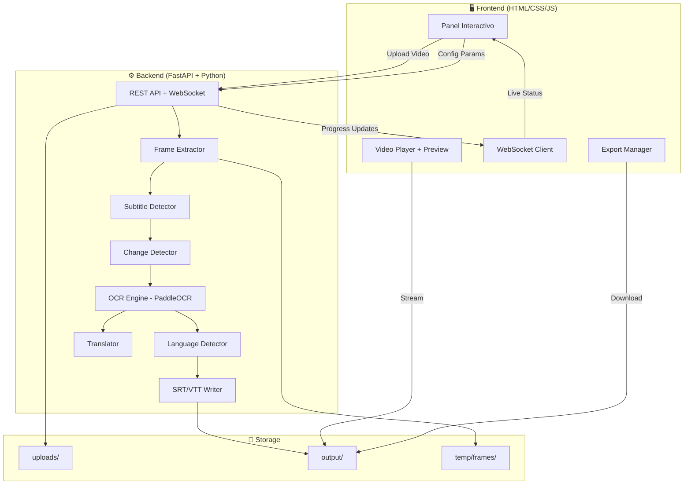

# 🎬 SubtitleForge — Aplicación Web Interactiva de Extracción de Subtítulos OCR

## Contexto

La guía actual (`guia_subtitulos_ocr.md`) es un documento técnico excelente pero puramente CLI. El objetivo es transformarlo en una **aplicación web interactiva completa** donde el usuario pueda:

1. **Subir un video** (drag & drop o file picker)
2. **Configurar parámetros** visualmente (calidad, zona de subtítulos, idioma, etc.)
3. **Ver progreso en tiempo real** (WebSocket para actualización live)
4. **Previsualizar resultados** con el video sincronizado con los subtítulos detectados
5. **Exportar** en múltiples formatos (.srt, .vtt, .json, .sbv)
6. **Traducir** opcionalmente a otro idioma

## User Review Required

> [!IMPORTANT]
> **Arquitectura Full-Stack**: Propongo usar **Python (FastAPI)** como backend para toda la lógica de procesamiento (OCR, OpenCV, etc.) y **HTML/CSS/JS vanilla** para el frontend. ¿Estás de acuerdo con este stack, o prefieres algo diferente?

> [!IMPORTANT]
> **Procesamiento en servidor**: El procesamiento OCR es pesado y requiere Python + PaddleOCR + OpenCV en el backend. Esto significa que la app necesita un servidor corriendo (no es solo frontend estático). ¿Esto es aceptable para tu caso de uso?

> [!WARNING]
> **Dependencias GPU opcionales**: PaddleOCR puede usar GPU para mayor velocidad. La versión CPU funciona pero será más lenta en videos largos. ¿Tienes GPU NVIDIA disponible?

## Open Questions

> [!IMPORTANT]
> 1. **Tamaño máximo de video**: ¿Hay un límite de tamaño que quieras imponer? (Sugiero 500MB por defecto)
> 2. **Traducción con Claude**: ¿Tienes una API key de Anthropic para la traducción? ¿O prefieres que integre una opción gratuita como LibreTranslate?
> 3. **Multiusuario**: ¿Es solo para uso personal (single user) o necesitas soporte multi-usuario con cola de procesamiento?

---

## Arquitectura Propuesta



---

## Proposed Changes

### Backend — FastAPI Server

#### [NEW] [server.py](file:///home/antoni/Downloads/BB/server.py)
FastAPI application entry point:
- `/api/upload` — POST endpoint para subir video (multipart form)
- `/api/process` — POST endpoint para iniciar procesamiento con configuración
- `/api/status/{job_id}` — GET endpoint para consultar estado
- `/api/results/{job_id}` — GET endpoint para obtener resultados
- `/api/download/{job_id}/{format}` — GET endpoint para descargar .srt/.vtt/.json/.sbv
- `/api/preview/{job_id}` — GET endpoint para preview del video con subtítulos
- `/ws/{job_id}` — WebSocket endpoint para progreso en tiempo real
- Servir archivos estáticos del frontend

#### [NEW] [processor.py](file:///home/antoni/Downloads/BB/processor.py)
Motor de procesamiento principal (refactored desde la guía):
- Clase `SubtitleProcessor` que orquesta todo el pipeline
- Ejecuta en background thread con actualizaciones via callback
- Stages: frame_extraction → zone_detection → change_detection → ocr → language_detection → grouping → translation
- Cada stage reporta progreso (porcentaje + mensaje descriptivo)
- Manejo robusto de errores por stage

#### [NEW] [modules/frame_extractor.py](file:///home/antoni/Downloads/BB/modules/frame_extractor.py)
Extracción de frames (mejorado de la guía):
- Usa `cv2.VideoCapture` con control de FPS
- Calcula FPS adaptativo según calidad del video
- Genera thumbnails para preview rápido
- Soporte para videos de alta resolución (downscale automático)

#### [NEW] [modules/subtitle_detector.py](file:///home/antoni/Downloads/BB/modules/subtitle_detector.py)
Detección de zona de subtítulos (de la guía, mejorado):
- Auto-detección top/bottom/full con score de confianza
- Soporte para zona custom (el usuario puede seleccionar en el frontend)
- Genera preview visual de la zona detectada

#### [NEW] [modules/change_detector.py](file:///home/Antoni/Downloads/BB/modules/change_detector.py)
Detector de cambios SSIM (de la guía, mantenido):
- Detección de cambios de subtítulo con SSIM
- Agrupamiento en bloques con timestamps

#### [NEW] [modules/ocr_engine.py](file:///home/antoni/Downloads/BB/modules/ocr_engine.py)
Motor OCR (de la guía, mejorado):
- PaddleOCR con fallback a EasyOCR
- Scoring de confianza por línea
- Post-procesamiento de texto (limpieza, normalización)

#### [NEW] [modules/language_detector.py](file:///home/antoni/Downloads/BB/modules/language_detector.py)
Detector de idioma (de la guía, mantenido)

#### [NEW] [modules/srt_writer.py](file:///home/antoni/Downloads/BB/modules/srt_writer.py)
Writer multi-formato:
- Genera .srt, .vtt (Web Video Text Tracks), .sbv, .json
- Formato enriquecido con metadatos

#### [NEW] [modules/translator.py](file:///home/antoni/Downloads/BB/modules/translator.py)
Traductor (de la guía, mejorado):
- Soporte para Claude API y LibreTranslate (gratuito)
- Traducción por lotes con contexto

---

### Frontend — Panel Interactivo

#### [NEW] [frontend/index.html](file:///home/antoni/Downloads/BB/frontend/index.html)
Página principal SPA:
- Layout responsive (desktop + mobile)
- Secciones: Upload → Config → Progress → Results → Export
- Flujo wizard paso a paso
- SEO tags, meta descriptions

#### [NEW] [frontend/styles.css](file:///home/antoni/Downloads/BB/frontend/styles.css)
Diseño premium con:
- **Dark mode** por defecto con tema cinematográfico
- **Glassmorphism** para paneles de configuración
- Gradientes sutiles (púrpura/azul cinematográfico)
- Tipografía Inter/JetBrains Mono
- Micro-animaciones CSS para transiciones entre pasos
- Progress bar animada con partículas
- Responsive design mobile-first

#### [NEW] [frontend/app.js](file:///home/antoni/Downloads/BB/frontend/app.js)
Lógica del frontend:
- Drag & drop upload con preview de video
- Panel de configuración interactivo (sliders, toggles, selects)
- WebSocket para progreso en tiempo real
- Video player integrado con sincronización de subtítulos
- Editor de subtítulos inline (corregir texto detectado)
- Export manager con selección de formato
- Manejo de estados (idle → uploading → configuring → processing → results)

---

### Configuration & Setup

#### [NEW] [requirements.txt](file:///home/antoni/Downloads/BB/requirements.txt)
Todas las dependencias Python:
```
fastapi
uvicorn[standard]
python-multipart
paddlepaddle
paddleocr
opencv-python-headless
scikit-image
lingua-language-detector
pysrt
numpy
pillow
tqdm
websockets
aiofiles
```

#### [MODIFY] [guia_subtitulos_ocr.md](file:///home/antoni/Downloads/BB/guia_subtitulos_ocr.md)
Actualizar la guía para documentar la nueva versión web:
- Agregar sección sobre la app web
- Documentar endpoints de la API
- Screenshots / instrucciones de uso

---

## Features del Panel Interactivo

### 1. 📤 Upload Zone
- Drag & drop con animación
- Preview del video con información (resolución, duración, codec, tamaño)
- Barra de progreso de upload
- Validación de formato (MP4, AVI, MKV, MOV, WebM)

### 2. ⚙️ Panel de Configuración
- **Calidad del análisis**: slider (Rápido ↔ Preciso) que ajusta FPS internamente
- **Zona de subtítulos**: selector visual (Top / Bottom / Auto / Custom)
- **Sensibilidad SSIM**: slider con tooltip explicativo
- **Confianza OCR mínima**: slider (0.5 → 1.0)
- **Idioma forzado**: dropdown o "Auto-detectar"
- **Traducción**: toggle + selector de idioma destino
- **Presets**: "Video Low Quality", "Standard", "High Quality", "4K"

### 3. 📊 Progreso en Tiempo Real
- Timeline visual del pipeline (7 stages)
- Porcentaje por stage + global
- Log en vivo tipo terminal
- Frame preview del procesamiento actual
- Tiempo estimado restante

### 4. 📝 Resultados
- Lista de subtítulos con timestamps
- Video player sincronizado (click en subtítulo → salta al momento)
- Estadísticas: idioma, total, duración promedio, posición
- Editor inline para corregir texto
- Comparación original vs traducido (side by side)

### 5. 💾 Exportación
- Botones de descarga: SRT, VTT, SBV, JSON
- Opción de descargar con o sin traducción
- Copiar al clipboard
- Preview del archivo antes de descargar

---

## Verification Plan

### Automated Tests
1. `pip install -r requirements.txt` — Verificar que todas las dependencias se instalan correctamente
2. `python server.py` — Verificar que el servidor inicia sin errores
3. Abrir en el browser y verificar que el frontend se sirve correctamente
4. Subir un video de prueba corto y verificar el pipeline completo

### Manual Verification
- Verificar que el drag & drop funciona
- Verificar que el progreso se actualiza en tiempo real via WebSocket
- Verificar que los subtítulos extraídos son correctos
- Verificar la exportación en todos los formatos
- Verificar el diseño responsive en mobile
